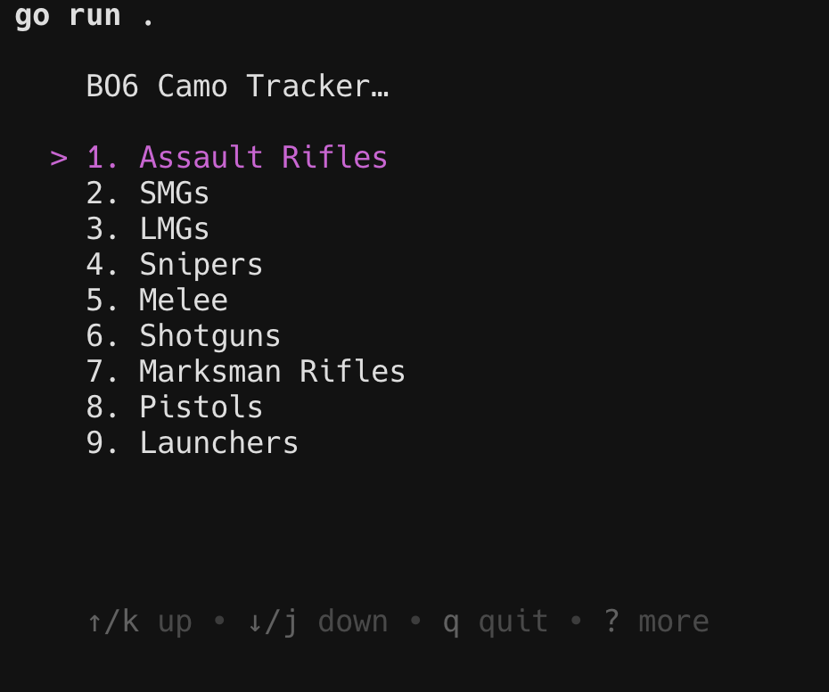
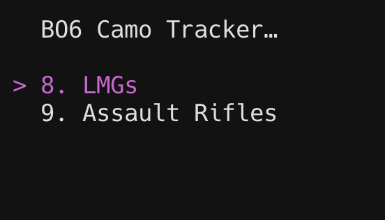
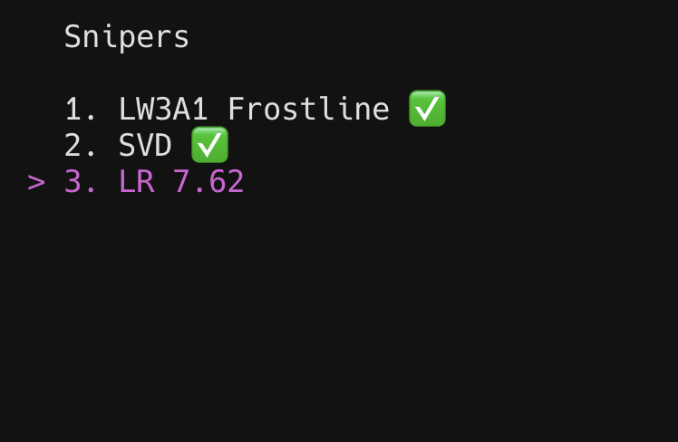

This is my first Go CLI program. It's a simple list viewer that allows you to toggle the checked state of a camo item for Black Ops 6. The list is populated from a JSON file that contains the camo items and their categories. The JSON file is embedded in the program and is used as the default data if the user doesn't have a writable JSON file.

To run the program, simply run `go run main.go` in the terminal. The program will create a JSON file called `camos.json` in the current directory if it doesn't already exist. You can edit this file to add or remove camo items as needed.

The program uses the [Bubble Tea](https://github.com/charmbracelet/bubbletea) library for rendering the list and the [Bubbles](https://github.com/charmbracelet/bubbles) library for the list viewer.

## Features

- Displays a list of camo items, grouped by category
- Allows you to toggle the checked state of a camo item
- Saves the camo items to a writable JSON file
- Provides a helpful message when the JSON file is missing or empty

## Screenshots

## License

This project is licensed under the GPL-3.0 License - see the [LICENSE](LICENSE) file for details.
